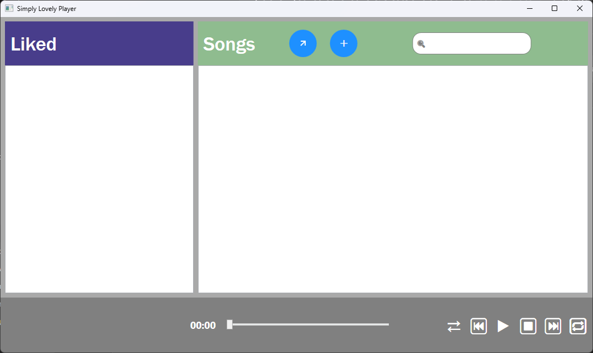

# Simply Lovely Player 🎵

A lightweight, modern desktop audio player built with **C#** and **WPF (.NET)** following the **MVVM (Model-View-ViewModel)** architectural pattern. 

Designed for managing and listening to offline audio tracks with intuitive navigation, custom playlist support, and playback controls.

---

## 📸 Screenshots

| Main Interface |
| :---: |
|  |

---

## ✨ Key Features

- **Core Playback Controls:** Play, pause, stop, track seeking (timeline slider), and volume/track progression tracking.
- **Track Navigation:** Previous / Next track switching, loop/repeat mode, and randomized **shuffle mode**.
- **Library & Search:**
  - Import and organize local audio files.
  - Real-time search/filter bar to quickly locate tracks in your collection.
  - Quick action buttons to add single tracks or batch import directories.
- **Favorites / Liked Section:** Dedicated section to bookmark favorite tracks for rapid access.

---

## 🏗️ Architecture & Technical Highlights

This application demonstrates clean architecture principles and idiomatic WPF development practices:

- **MVVM Architecture:** Strict separation of concerns between UI (XAML Views), presentation logic (ViewModels), and business entities (Models).
- **Command Pattern (`ICommand`):** UI button clicks and actions are decoupled from code-behind using custom `RelayCommand` implementations.
- **Data Binding & Observable Collections:** Data is bound declaratively in XAML, utilizing `INotifyPropertyChanged` and observable structures to keep UI synchronized with model state.
- **Value Converters (`IValueConverter`):** Custom converter implementation (`BoolToVisibilityConverter`) for dynamic UI state presentation.

---

## 🛠️ Tech Stack

- **Language:** C#
- **Framework:** .NET (WPF - Windows Presentation Foundation)
- **UI Architecture:** XAML, MVVM Pattern
- **IDE:** Visual Studio

---

## 🚀 Getting Started

### Prerequisites
- Windows 10/11
- [.NET Runtime / SDK](https://dotnet.microsoft.com/download)
- Visual Studio (with *.NET desktop development* workload)

### Installation & Run

1. **Clone the repository:**
   ```bash
   git clone https://github.com/mA1nBTW/SimplyLovelyPlayer.git
   cd SimplyLovelyPlayer
   ```

2. **Open with Visual Studio:**
   - Double-click `SimplyLovelyPlayer.sln` to open the solution.

3. **Build & Run:**
   - Press `F5` or click **Start** in Visual Studio.
   - Alternatively, build and run via CLI:
     ```bash
     dotnet build
     dotnet run --project SimplyLovelyPlayer
     ```

---

## 👤 Author

- **Mykhailo** — GitHub: [@mA1nBTW](https://github.com/mA1nBTW)